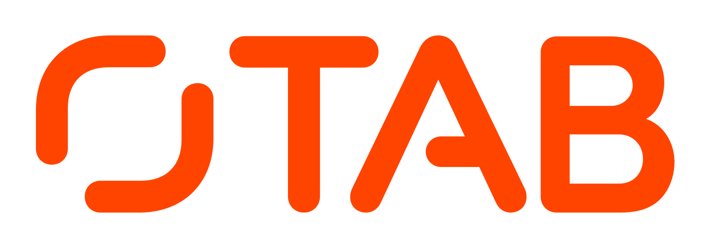

<p align="center">
  
</p>


Thank you for applying to join our team at TAB! We'd now like to see an example of how you work.

> 👋 If you haven't applied yet, please do so via www.theappbusiness.com/careers. We cannot accept submitted code without a prior application.

# 🛠 TAB Technical Challenge

Please build an app to showcase a small sample of some of the amazing work TAB has delivered over the years.

You are required to show the list of TAB case studies available [here](./endpoints/v1/caseStudies.json?raw=1). Please embed the URL below into your codebase. On launch, the app should always fetch the latest case studies from the given URL. If we add more case studies in the future, your app will display the up-to-date list. Do not read from hardcoded JSON.

**Fetch from the following URL:**
```
https://raw.githubusercontent.com/theappbusiness/engineering-challenge/master/endpoints/v1/caseStudies.json
```

# 👫 Requirements

The requirements are broken down into two [user stories](https://en.wikipedia.org/wiki/User_story):

* **TAB-001:** As a user, I want to see a list of case studies with an image and teaser.
* **TAB-002:** As a user, I want to read the full article when I select a case study from the list.

While completing these user stories, you may wish to commit your code to a local Git repository.

When you are done, please send via email the zipped up directory containing your project.

> ⚠️ Please do not push your work to a public repository.

If you make intermediate commits to a local repository, the most important thing is that you are proud of the code submitted at the end. Don't worry about the code cleanliness or robustness of earlier commits.

Please structure the code as you would for a production app that will be extended and maintained in the future. There is no need to leave comments in the code, as long as the code is self-documenting.

# 🔗 Example

You can see an example of how our case studies appear on the [TAB website](https://www.theappbusiness.com/work). However, we expect the user experience to vary between a mobile app and the website. Please put your own stamp on the project to make something that looks and feels great on the target operating system.

> ℹ️ A good place to start is to look at the JSON and the website together. You will see how the keys in the JSON relate to the content on the website. By doing this, you will see the keys that you will need to use to deliver your solution. There are additional keys in the JSON that you are not required to make use of.

# ✅ Acceptance criteria

The acceptance criteria are open to your interpretation and creativity. If in doubt, do what feels right or ask for clarification.

## TAB-001

* When opening the app, the user should see the list of case studies available in the JSON at the given URL.
* The user should see the list of case studies as per the array value for the `"case_studies"` key in the JSON.
* For each case study in the list, the user should see:
  * a hero image, available from the URL value provided for the `"hero_image"` key;
  * teaser text as per the `"teaser"` key in the JSON.

## TAB-002

* The user can navigate to read a full article by selecting a case study from the list.
* For the full article, the user should see:
  * a hero image, available from the URL value provided for the `"hero_image"` key;
  * the title as per the `"title"` key;
  * body content broken into sections, as per the array value for the `"sections"` key;
* For each section of body content, the user should see:
  * the section title (if provided in the JSON). This should be in a strong font weight to distinguish it from body text. It is read from the section's `"title"` key;
  * a list of body elements (either text or images). These are read from the `"body_elements"` key.
* The user should be able to easily return to the full list of case studies (delivered in TAB-001).

### Additional notes for TAB-002

* Body text is given as a string in the `"body_elements"` array.
* In-line images are represented as JSON objects with a single key `"image_url"`. These should be displayed in-line as they appear between text in the JSON.

# 📱 Platform-specific requirements

If you're applying for an iOS Engineering position, please read the [additional requirements for iOS](./platforms/ios/additional-requirements.md).

# 🎨 Putting your stamp on it

No designs are provided. As such, you can put your own creative stamp on the delivered software. You are encouraged to add any nice touches that you feel showcase your abilities. However, the most important thing is that your code works, it is well structured and it meets the acceptance criteria laid out above.

# 🔍 Any questions

Please don't hesitate to contact us with any questions. It's better to ask clarification questions up front.
